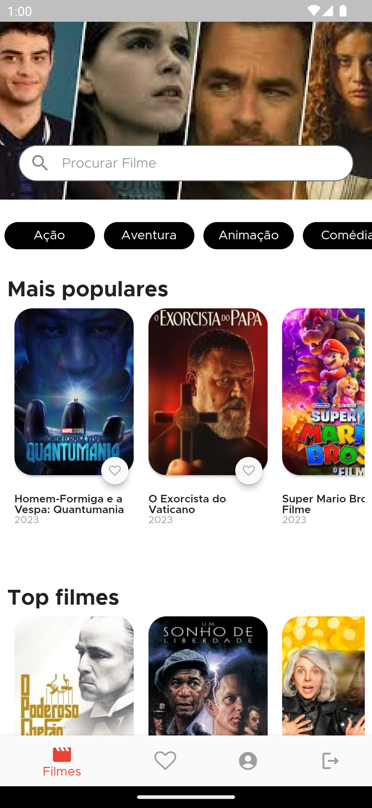
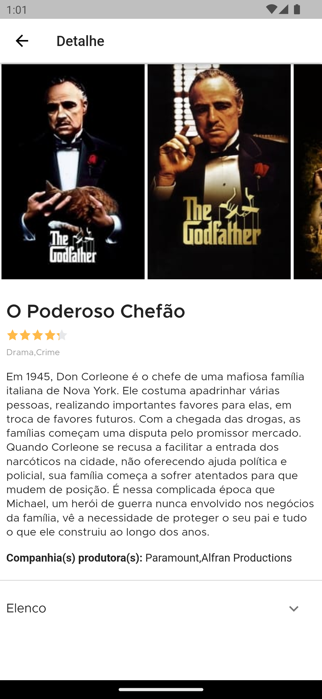
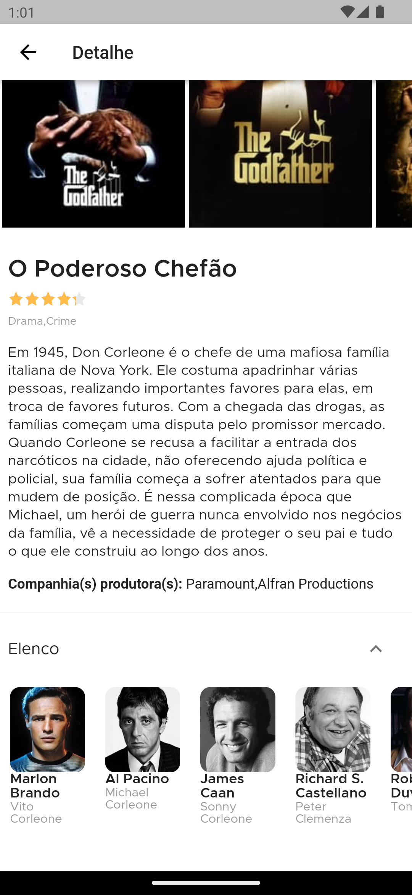

# DW4 Movies App

Projeto criado durante a 4ª Dart Week da [Academia do Flutter](http://academiadoflutter.com.br/).
Onde foi desenvolvido um app de filmes consumindo a API do The Movie Database, package Dio, GetX como Gerenciamento de Estado e Gerenciamento das dependências.

## Funcionalidades

- [x] Splash
- [ ] Login
- [ ] Register
- [x] Home
- [x] Movies
- [x] Movies Detail
- [x] Favorites
- [ ] Profile

## Screens

    
    
    

